TaeMOBA
=======

O TaeMOBA (nome provisório) será um jogo competitivo online desenvolvido por
[Taelin](https://github.com/VictorTaelin) em seu tempo livre (fora do horário de
trabalho da [HOC](https://HigherOrderCO.com)).

## Resumo

O TaeMOBA nasce de uma frustração pessoal com o design de MOBAs modernos. Na
minha percepção, poucos desenvolvedores pensam fora da caixa. Dogmas raramente
são questionados e mecânicas novas raramente quebram normas estabelecidas.
Resumidamente, todos os MOBAs modernos são extremamente parecidos entre si. O
TaeMOBA propõe-se a quebrar completamente a fórmula, criando algo inovador e
original, baseado em ideias e pensamentos que acumulei ao longo de anos.

Uma das características mais importantes desse projeto é que seu design não será
pré-definido em um GDD estático, como é feito geralmente. Ao invés disso,
diversas ideias serão exploradas, selecionadas e descartadas, fazendo com que o
resultado final seja lapidado de forma interativa e evolutiva. Ou seja, o
TaeMOBA, nos seus primeiros meses, terá um **Game Design dinâmico** que aos
poucos será solidificado.

Isso é possível porque o jogo será programado usando uma linguagem de
programação altamente abstrata, conhecida como "Cálculo das Construções",
implementado [neste](https://github.com/VictorTaelin/taelang) repositório. Essa
escolha permitirá que o código evolua de forma extremamente rápida, e que
mudanças drásticas sejam feitas em pouco tempo, permitindo explorar diversas
ideias antes de chegar ao design final. Essa escolha também nos permite trocar
de game engine com facilidade, livrando-nos de ficar presos a um framework
específico.

## Conceitos

Apesar do design do TaeMOBA ainda estar sendo definido, já temos diversos
conceitos potenciais. Aqui, descreverei alguns deles, cobrindo tópicos desde o
modelo de negócios do jogo até conceitos de game design e arte. Quando não
especificado, deve-se assumir que o TaeMOBA será parecido com outros jogos do
gênero. Por exemplo, o conceito de "partidas 5v5 com um vencedor", os modos de
jogo (normal, ranqueado etc.), elos, lobbies, listas de amigos e itens
cosméticos; tudo será herdado dos MOBAs tradicionais sem grandes mudanças.
Porém, no jogo em si, muitos aspectos serão significativamente alterados.

### Marketplace de Cosméticos

Em 2021, o jogo Fortnite gerou uma receita de quase **6 bilhões** de dólares
apenas com a venda de cosméticos digitais
([fonte](https://www.tweaktown.com/news/91786/fortnite-made-nearly-6-billion-from-in-game-purchases-2021/index.html)).
Ao mesmo tempo, designers e artistas brasileiros vendem seus trabalhos – que
muitas vezes levam dias para criar – por valores tão baixos quanto R$100 ou até
menos. Isso revela uma realidade cruel: por um lado, jogos online criaram um
mercado gigantesco onde pessoas gastam fortunas comprando artes digitais;
afinal, o que mais seria uma "skin"? Por outro, esse valor é integralmente
capturado por grandes empresas, enquanto artistas da vida real mal se beneficiam
dele. É hora de mudar esse mercado.

O TaeMOBA vem para fazer com as grandes empresas de GameDev o que o Uber fez com
os táxis: trazer esse valor de volta para quem produz. No TaeMOBA, haverá um
mercado de cosméticos onde artistas poderão criar e comercializar suas próprias
skins, e a maior parte da receita gerada por essas skins será enviada
diretamente para o artista.

### Revshare com Pro Players (aka "ELO Remunerado")

Grande parte do sucesso de jogos como League of Legends e Valorant pode ser
atribuída ao seu cenário competitivo. Em 2018, a Riot destinou um Prize Pool de
6 milhões de dólares para o campeonato mundial de League of Legends. Esse valor
parece exorbitante, mas se esvanece ao perceber que é cerca de 0.1% da receita
de cosméticos (que é uma fração da receita total). Além disso, a base do cenário
competitivo – isto é, jogadores que se dedicam intensamente para alcançar os
elos mais altos nos modos ranqueados – não é remunerada, o que gera incertezas e
falta de estabilidade econômica para aqueles que são a base desses eventos, que
geram, direta e indiretamente, lucros substanciais para as empresas.

O TaeMOBA pretende quebrar esse paradigma e valorizar de verdade o cenário
competitivo, redirecionando uma porcentagem fixa da receita total diretamente
para os jogadores de elo mais alto dos modos ranqueados, conhecidos como
"Challengers". Isso não apenas oferecerá uma segurança e estabilidade para
aqueles que almejam fazer parte do cenário competitivo, como também aumentará o
próprio significado e valor dos elos no modo ranqueado.

### Mecânicas Únicas ("Abathurização")

O MOBA Heroes of the Storm se destacou pela criação de personagens com mecânicas
únicas, que quebravam a fórmula dos MOBAs tradicionais de maneiras inovadoras.
Por exemplo, "Abathur" é uma personagem extremamente frágil, que morre
fácilmente com um único ataque, mas possui uma habilidade de escolher e
fortalecer qualquer personagem do jogo, com alcance global. A experiência de
jogar com esse personagem é totalmente diferente; um jogador de Abathur
raramente move seu personagem, focando mais no mapa de forma global, buscando
oportunidades para influenciar positivamente seu time. Outros personagens que
quebram regras incluem Cho'Gall (um único personagem controlado por dois
jogadores), Murky (que não "morre", mas nasce quase imediatamente em seu ovo) e
Deathwing (um dragão gigante imune a controle de grupo que pode voar pelo mapa
como um boss de raid).

No TaeMOBA, esse princípio será adotado e amplificado significativamente.
Teremos personagens que quebram a fórmula padrão, de formas que nem o HotS
ousou. Alguns exemplos:

A. Um fantasma sem "personagem", que atua como um "mestre das torres", afetando
as estruturas e os minions aliados para auxiliar na vitória – ou seja, um
personagem que joga o jogo como um "tower defense".

B. Uma "planta alienígena invasiva" que, ao contrário, tem dezenas de
"personagens" imóveis, cujo objetivo é se espalhar pelo mapa, formando uma
"floresta" que favorece seu time em pontos-chave. Jogar com este campeão exige
uma capacidade altíssima de multitarefa por ter de controlar várias unidades.

C. Um "mercador" que substitui a loja e passa o jogo inteiro forjando itens para
seus aliados. Jogar com esse personagem torna o jogo similar a um jogo de
cartas, como "Hearthstone".

D. Uma "tartaruga blindada" que se move a 30% da velocidade mas tem uma grande
quantidade de vida e defesa. Seria um personagem tático que requer coordenação
com a equipe para ter valor.

E. Uma "monge psíquica" (pense em Abra) extremamente frágil, sem habilidade de
dano, mas que pode se teletransportar pelo mapa e transportar aliados. Jogar
esse personagem requer coordenação em equipe e posicionamento perfeito,
valorizando a comunicação.

Esses e outros designs serão constantemente explorados e testados no TaeMOBA. Em
outros MOBAs, conceitos são raramente adotados e os personagens geralmente têm
atributos semelhantes, velocidade de movimento e funções padronizadas. Isso é
feito porque esses MOBAs não foram projetados pensando em personagens muito
diferentes, cuja presença poderia causar problemas e frustrações. Por exemplo,
pode ser desagradável mudar a forma de jogar porque alguém escolheu um
personagem que quebra as regras. E balancear personagens que fogem à regra é um
desafio.

Acredito que esses problemas, quando ocorrem, são causados por falhas de design
e que há várias maneiras competentes de projetar os personagens e adaptar o
próprio jogo para evitar pontos negativos, abrindo espaço para a criação de
personagens que fogem à regra e fornecem experiências únicas. Por exemplo, cada
personagem que desafia as regras deve ter uma fraqueza clara e explorável que
anula sua mecânica, dando uma opção de resposta ao time adversário. E um sistema
de draft inteligente, onde é possível escolher o tipo de aliado que se aceita
ter no time, reduziria significativamente a frustração de estar com um
personagem que força uma mudança na forma de jogar.

### Scaling Anti-Snowball (-nível -ouro -toxicidade)

Um dos aspectos mais frustrantes dos MOBAs é o "efeito bola de neve", ou seja,
quando "uma vitória torna a próxima vitória mais provável". Por exemplo, se você
joga mal e morre no primeiro minuto, respira, volta pra lane, passa a jogar
decisivamente melhor que o adversário, porém perde a próxima luta deixando-o com
1 HP; essa morte é culpa do efeito bola de neve, já que você teria vencido se os
stats ainda fossem iguais. E, na próxima luta, seu oponente estará ainda mais
forte, amplificando esse efeito em loop.

Se a intenção de um MOBA é ser um esporte digital, então o efeito bola de neve é
um problema de game design, pois cria uma "curva de importância" onde os
primeiros minutos tem mais peso que os últimos. Isso é extremamente frustrante
para o jogador e um dos maiores geradores de toxicidade. Afinal, se seu time
morreu diversas vezes nos primeiros 5 minutos, pouco importa se vocês jogarem
melhor pelos próximos 25 minutos – provavelmente perderão a partida.  Portanto,
há pouco incentivo para motivar o time; pode parecer mais fácil xingar e "dar
FF". De fato, a própria mecânica de desistência é uma consequência do efeito
bola de neve! Além disso, jogos como LoL implementam inúmeras mecânicas para
amenizar esse efeito, mas essas são soluções paliativas que não resolvem a
origem do problema.

Esse problema é algo artificial, criado pelos próprios desenvolvedores dos
jogos, por não refletir sobre os efeitos de suas decisões de game design. Nos
esportes tradicionais, a bola de neve nunca foi um problema. No basquete, por
exemplo, quando um ponto é marcado, a perna do jogador não cresce; no futebol,
um gol não aumenta o tamanho do gol adversário. No futebol, se você joga mal nos
primeiros 10 minutos e sofre 3 gols, mas depois joga melhor que o adversário,
provavelmente vencerá! Os minutos restantes da partida valem tanto quanto, e os
jogadores do time adversário não se transformam em titãs colossais por conta dos
gols iniciais.

O TaeMOBA pretende questionar o efeito bola de neve, não através de remendos,
mas com uma decisão mais simples: a eliminação quase completa dos efeitos de
"escalabilidade". Conceitos como *nível* e *ouro*, que fortalecem numericamente
o personagem, serão quase totalmente excluídos do jogo. Em outras palavras, o
TaeMOBA manterá a seguinte invariante: **a qualquer momento do jogo, se as
equipes X e Y se enfrentarem, sairá vitoriosa aquela que jogar melhor naquele
momento, independentemente do que aconteceu no passado**.

Isso pode suscitar preocupações e dúvidas. Argumentações de que a remoção dos
níveis necessariamente tornaria o jogo menos competitivo são equivocadas; tais
pensamentos se baseiam na ideia de como seria remover os níveis de um MOBA
conhecido, como o LoL, sem nenhuma outra alteração. O TaeMOBA é um novo jogo que
pode ser projetado para manter ou até aumentar o nível de competitividade e
destreza, mesmo sem níveis. Um exemplo disso é o jogo Super Smash Bros., que
possui uma das comunidades competitivas mais antigas e robustas e não possui
conceitos de nível, checagens de status ou efeito bola de neve.

Em resumo, o TaeMOBA pretende ser um esporte digital que elimina o efeito bola
de neve de maneira fundamental, removendo conceitos como "nível" e "ouro",
mantendo a competitividade de outras formas que não envolvem verificações de
status. Minha hipótese é que isso não só reduzirá a toxicidade no jogo como
também o tornará mais divertido, já que todos os minutos da partida terão o
mesmo peso, permitindo comebacks naturais sempre que você jogar melhor que o
adversário na segunda metade do jogo.

### Gráficos

Os gráficos do TaeMOBA ainda não estão completamente definidos, mas, devido ao
Marketplace de Cosméticos, a intenção é que ele tenha uma câmera top-down com
gráficos 2D em pixel art. Isso aumentará a quantidade de profissionais que
poderão criar e comercializar suas artes no jogo, pois há mais artistas de 2D do
que os especializados em modelagem e animação 3D.

A questão é: que tipo de gráfico, concretamente, se adequaria melhor aos
objetivos do TaeMOBA? Gráficos muito detalhados podem ser visualmente atraentes,
mas podem elevar a barreira de entrada para artistas interessados. De maneira
semelhante, o número de direções que um personagem pode olhar pode alterar
significativamente o custo para criar uma skin nova. Por exemplo, em jogos como
Ragnarok Online, cada pose precisa ser criada em 5 posições diferentes. Isso
resulta em gráficos atraentes, mas com custos de produção muito mais altos.

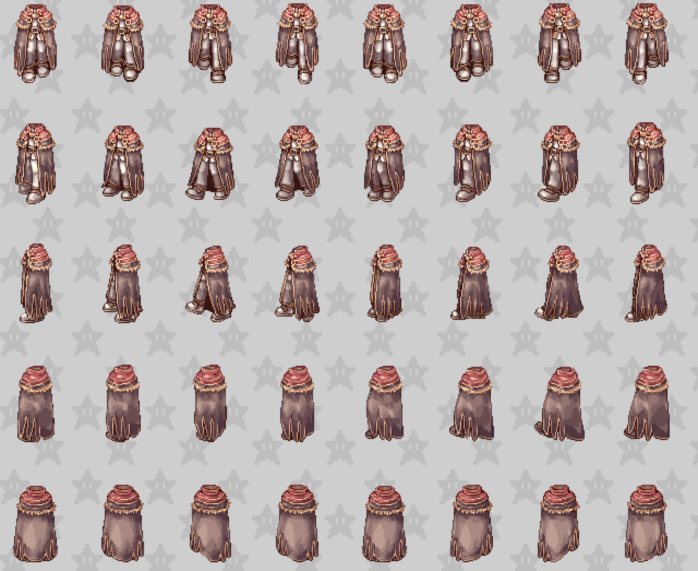

Um outro extremo seria ter apenas uma direção de olhar: para a frente.
Inicialmente, pode parecer uma abordagem rígida e inviável, mas com o uso
inteligente de efeitos, é possível criar um estilo engajante. Um bom exemplo é o
jogo Among Us. Repare que o personagem jamais olha para baixo, apesar de estar
se locomovendo para baixo!

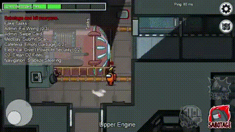

Para o TaeMOBA, um estilo mais "afiado" faz sentido para mim. Um ótimo exemplo é
o jogo "Wizard of Legend". Os personagens têm 3 direções (para cima, para a
esquerda e para baixo), e não é difícil imaginar como funcionaria com uma
direção só. Esse estilo é mais sério e "dark", o que combina com um jogo
competitivo. A ausência de contornos e o sombreamento simplificado (apenas 2
tons de luz) facilitam a produção.

Em relação às animações de combate, a referência que considero extremamente
relevante é o Fire Emblem em sua fase de pixel art. Eles passam a sensação de
dinamismo e poder, usando uma quantidade mínima de frames.

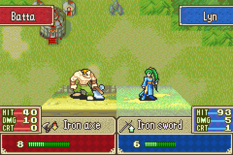

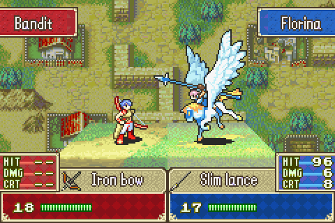

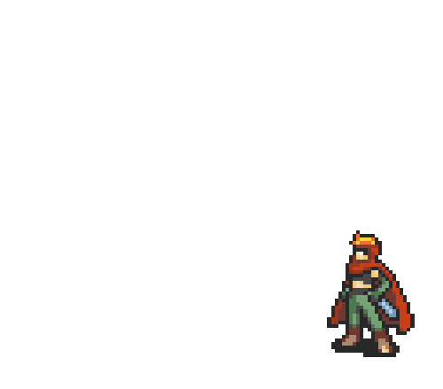

Mas como é possível passar tanto dinamismo, com tão poucos frames? Se
analisarmos as sprite sheets, conseguimos notar fatores essenciais.

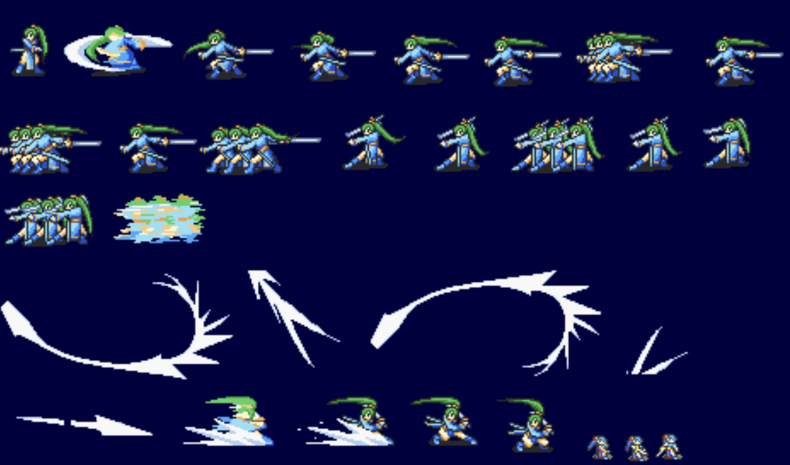

1. **Keyframes cirúrgicos**: o personagem é desenhado em poucas poses (essa
   animação inteira tem apenas 4 poses!), porém, as poses escolhidas são
   justamente as mais pivotais para o movimento. Por exemplo, no primeiro gif, o
   momento em que a espada está maximamente virada para trás se tornou um
   keyframe. Esse efeito não só diminui os custos e facilita a comunicação
   visual, como também pode ser usado para causar a sensação de impacto. Por
   exemplo, no segundo gif, o momento em que a pegasus-knight acerta o arqueiro
   com a lança é um único keyframe que fica "parado" por mais de um segundo (!),
   destacando o impacto do momento.

2. **Transições via motion blur**: a transição entre 2 keyframes é, quase
   sempre, feita via motion blur. Por exemplo, do frame 0 para o frame 2, não
   existem frames intermediários levando a espada da "bainha" até a posição onde
   ela está maximamente virada para trás. Ao invés disso, apenas um "vulto" é
   desenhado, representando, em um único frame, todo o movimento de saque. De
   fato, isso é tão utilizado que os movimentos mais rápidos são feitos sem nem
   desenhar o personagem! Por exemplo, as duas "espadadas" são representadas
   pelo motion blur da espada, sem qualquer pose desenhada.

3. **Animação de tecidos e cabelos durante keyframes.** Por mais que frames
   congelados "passem" ao animar nossos heróis (afinal, o corpo deles se movem a
   uma velocidade altíssima!), essa "desculpa" não cola para partes "mortas"
   coladas ao corpo dos personagems, ou seja, cabelos e tecidos. Repare como o
   cabelo e roupa do primeiro personagem é animado durante os frames congelados.
   Isso não só recupera a fluidez "perdida" pelo uso de poucos frames, como
   acaba aumentando a sensação de velocidade; afinal, se o cabelo está demorando
   para voltar para a posição de repouso, isso significa que o personagem chegou
   lá de forma extremamente ágil.

Para ambientes e fundo, imagino algo com cores mais suaves, poucos detalhes e
baixa complexidade. Isso é importante para destacar os personagens do fundo. Por
exemplo, o jogo "Rivals of Aether" tem gráficos lindos, mas às vezes é difícil
localizar os personagens na tela. Observe as imagens abaixo e, para cada uma,
responda: quantos personagens tem na tela?

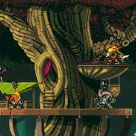
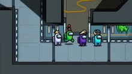

A simplicidade dos gráficos do Among Us torna muito mais fácil separar os
personagens do fundo e entender o que está acontecendo. Para o TaeMOBA, devemos
manter um mapa/ambiente simples com cores pastel, destacando os personagens e
objetos. Uma ideia que me vem à cabeça é desenhos como Adventure Time e Steven
Universe, que usam paletas de cores que criam imagens atraentes sem muita
complexidade visual.

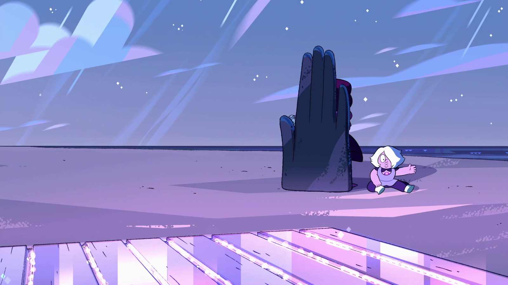

Outras inspirações (que não seguem todos os pontos mencionados, mas são
interessantes de se estudar):

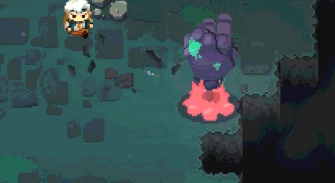

Em resumo, estou analisando a melhor abordagem gráfica para a proposta do
TaeMOBA, mas inicialmente estou inclinado a optar por um design 2D com um fundo
simples, suave e em cores pastel, e personagens voltados para apenas uma direção
(frente), com sombreamento simplificado e animações fluidas com poucos
quadros-chave e uso extensivo de motion blur para transmitir sensações de
velocidade, impacto e força.

### Mapa e Objetivos

O mapa do TaeMOBA será construído de forma diferente dos MOBAs convencionais, com um ambiente aberto e um design assimétrico, inspirado em jogos como Fire Emblem. Nele, os jogadores encontrarão múltiplos objetivos espalhados por diferentes áreas do mapa, como vilas com itens para coletar, florestas para extrair recursos, minas para explorar, cavernas de dragões para derrotar e pilhar, e castelos para estabelecer bases e artilharia. O objetivo principal será pontuar através da conclusão de diversos objetivos e combinação de diferentes estratégias para vencer a partida.

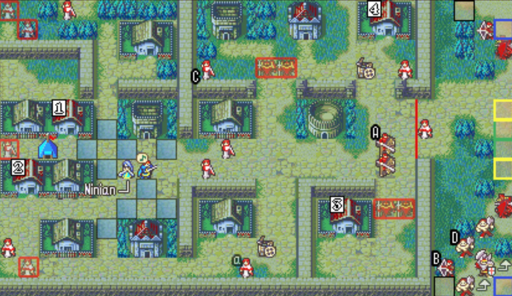
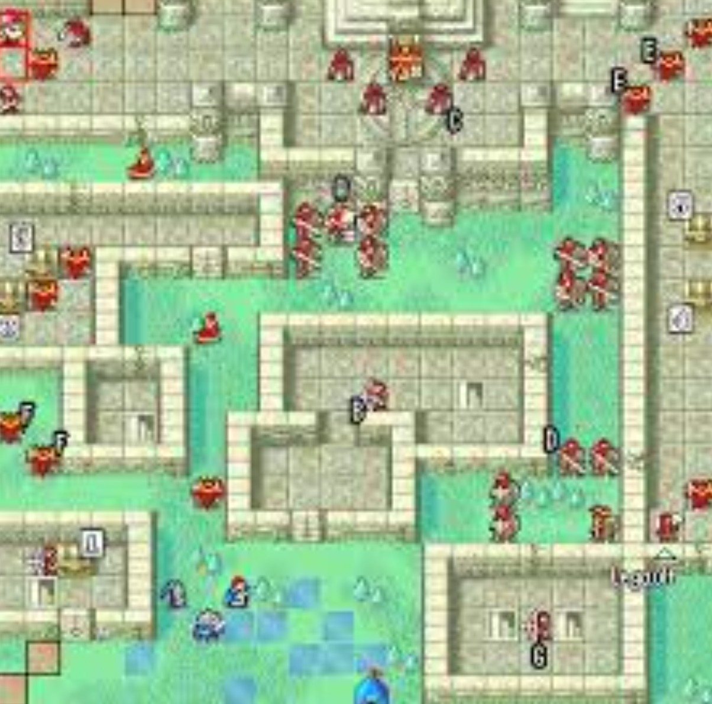
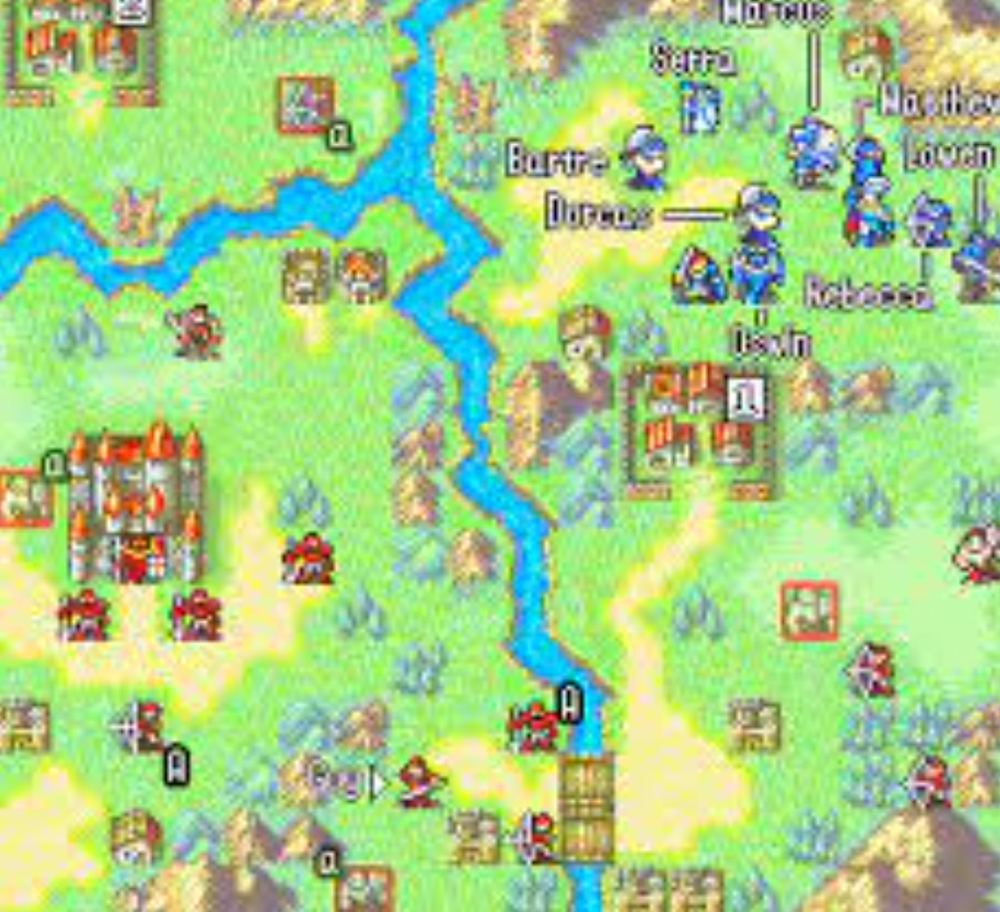

Por exemplo, acima estão algumas imagens de mapas do Fire Emblem, mostrando
campos abertos com várias "coisas" espalhadas (salas, baús, castelos, etc.),
permitindo que os jogadores se movam livremente e realizem os objetivos na ordem
que desejarem. (Ignore o estilo retrô e baseado em tiles; esse não é o ponto.
Estou usando o Fire Emblem apenas para ilustrar a ideia.)

No TaeMOBA, não haverá uma fase de rotas tradicional e o jogo será centrado na realização de objetivos, coleta de recursos e pontuação por diversos meios. Dessa forma, os jogadores terão liberdade para explorar diferentes estratégias de jogo, incluindo evitar interações com o time adversário e focar em objetivos, entrar em "modo guerra" e ir diretamente para lutas em equipe, e muitas outras abordagens intermediárias. Essa flexibilidade permite uma experiência de jogo dinâmica e emocionante, com várias formas de obter a vitória e diferentes desafios a enfrentar a cada partida.

Em resumo, o mapa e os objetivos do TaeMOBA serão projetados para oferecer uma experiência única e inovadora, com várias possibilidades de estratégias e caminhos para a vitória. O jogo será centrado na realização de objetivos e coleta de recursos, permitindo aos jogadores explorar várias táticas e estilos de jogo, resultando em uma batalha emocionante e imprevisível a cada partida.
